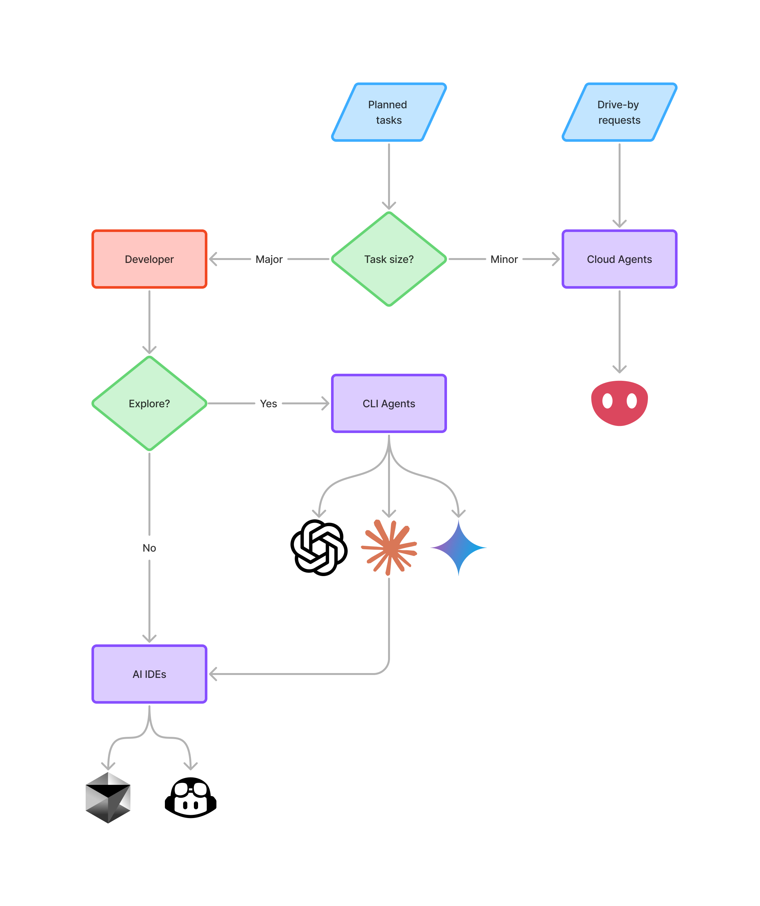

# Automa

[Automa](https://automa.app) is an automation platform that allows the user to complete coding tasks remotely with any coding agent (Claude Code, Codex, Gemini, etc, or custom) from integrations (GitHub, Linear, Jira, Slack, etc) directly with all the required context.

Some links to get started:

- [Website](https://automa.app)
- [Documentation](https://docs.automa.app)
- [Self-hosting](https://docs.automa.app/self-hosting)
- [Bot Development](https://docs.automa.app/bot-development)
- [SDKs](https://docs.automa.app/sdks)
- [Discord](https://discord.gg/z4Gqd7T2WQ)
- [Licensing](https://docs.automa.app/self-hosting/licensing)

   
  <picture>
    <source media="(prefers-color-scheme: dark)" srcset="./packages/marketing/src/assets/landing/hero_dark.png">
    
  </picture>
   
   

## Ideal developer workflow

The software development process has been in a constant state of flux with the rise of LLMs and AI tools. Please find below the current ideal workflow which we will try our best to keep up to date.

  <picture>
    <source media="(prefers-color-scheme: dark)" srcset="./packages/marketing/src/content/docs/images/workflow_dark.png">
    
  </picture>

## Contributing

Contributions and feedback are welcome! Feel free to open an issue or submit a pull request. See [CONTRIBUTING.md](CONTRIBUTING.md) for more details. Here is a list of [Contributors](https://github.com/automa/monorepo/contributors).

## LICENSE

[BUSL-1.1](LICENSE)

## Bug Reports

Report [here](https://github.com/automa/monorepo/issues).
