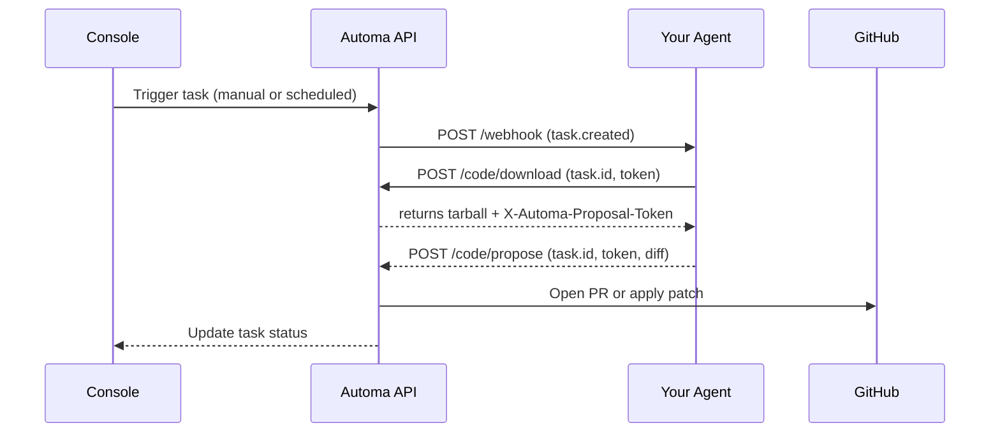

Automa agents (or bots) are the components that execute your automation logic. This guide walks you through building, testing, and deploying a custom agent and integrating it with Automa.

## How Agents Work

Agents are external services you host that connect to Automa over a webhook. When a task is triggered—either manually or on a schedule—Automa sends your agent the latest snapshot and instructions. Your agent performs its logic and returns the desired code changes back to Automa, which then applies or proposes the updates in your repository.

## Getting Started

Developing an agent typically involves these steps:

1. **Scaffold your project**: Choose your runtime (Node.js, Python, etc.) and create a new project.
2. **Implement your webhook**: Expose an HTTP endpoint to receive task payloads and return results.
3. **Test locally**: Use a tunneling tool (e.g., ngrok) to connect your local server to Automa Console for rapid iteration.
4. **Deploy your agent**: Host your service on a production-grade platform (AWS, Vercel, Heroku, etc.).
5. **Register and install**: In Automa Console, add your agent with its name, description, trigger and intelligence settings, then install it on target repositories.

## Task Lifecycle



## Scaffolding Your Agent

Start by creating a new project using your preferred language and framework. You'll need a lightweight HTTP server that can parse JSON and expose a single route to handle incoming task requests.

## Implementing the Webhook

Your agent exposes a single HTTP endpoint (for example `/webhook`) to receive task notifications from Automa. Implement it as follows:

### 1. Validate the request signature

Automa signs each payload with HMAC‑SHA256. The signature header looks like:

```
webhook-signature: v1,<signature>
```

【F:packages/api/src/events/jobs/sendTaskWebhook.ts†L185-L190】

Compute and verify the signature using your agent’s `webhook_secret` (after removing the `atma_whsec_` prefix):

```js
const hmac = createHmac('sha256', webhookSecret);
hmac.update(`${id}.${timestamp}.${JSON.stringify(body)}`);
const expected = `v1,${hmac.digest('base64')}`;
```

【F:packages/api/src/events/jobs/sendTaskWebhook.ts†L160-L168】

### 2. Parse the payload and headers

Automa sends a JSON body with this shape:

```json
{
  "id": "whmsg_task_created_<taskId>",
  "type": "task.created",
  "data": {
    /* task, repo, org, items */
  },
  "timestamp": "2023-01-01T00:00:00.000Z"
}
```

【F:packages/api/src/events/jobs/sendTaskWebhook.ts†L178-L187】

And these headers:

- `webhook-id`: the same as `body.id`
- `webhook-timestamp`: UNIX timestamp
- `webhook-signature`: HMAC signature
- `x-automa-server-host`: Automa server URL
  【F:packages/api/src/events/jobs/sendTaskWebhook.ts†L185-L205】

### 3. Execute your logic

Based on `body.type` (e.g. `task.created`) and its `data`, run your automation (clone repo, run scripts or AI models, etc.).

### 4. Respond with results

Return a 2xx JSON response. For code tasks, include a `diff` or patch:

```json
{ "diff": "diff --git a/... b/...\n..." }
```

## Error Handling & Retries

> Keep your agent reliable and idempotent when failures happen.

### HTTP Response Codes

- Return **2xx** to acknowledge successful processing.
- Return **4xx** (e.g. `404`, `403`, `401`) for invalid tasks, tokens, or signatures. Automa treats these as permanent failures and will not retry.
- Return **5xx** (e.g. `500`, `503`) for transient or server errors. Automa will automatically retry webhook deliveries with an exponential backoff.

### Task & Token Validation

Automa enforces valid task tokens and maximum task age in its `getTask` utility:

```ts
// packages/api/src/routes/code/utils.ts#getTask
if (!task) return reply.notFound('Task not found');
if (task.created_at < Date.now() - 7*24*60*60*1000)
  return reply.forbidden('Task is older than 7 days');
```

【F:packages/api/src/routes/code/utils.ts†L22-L34】

### Automatic Retries & Idempotency

Any non‑2xx response or network failure will cause Automa to retry your webhook. To avoid side effects:

- Use `task.id` and tokens to detect duplicate requests.
- Ensure each webhook run is idempotent (safe to run multiple times).
- Persist or lock shared resources to prevent race conditions.

## Local Testing

During development, run your agent locally and use a tunneling service (like ngrok) to expose it. Register this temporary URL in Automa Console to test your webhook against real tasks without redeploying each change.

## Deployment

Deploy your agent to a reliable hosting platform. Ensure that your endpoint is secured (TLS, authentication tokens), implements proper error handling, and logs activity for troubleshooting.

## Registering and Installing Your Agent

In Automa Console:

1. Go to **Agent Development** → **Create Agent**.
2. Fill in the agent details:
   - Name and short description
   - Trigger type (Manual or Scheduled)
   - Intelligence mode (Deterministic or AI)
   - Webhook URL
   - Optional image or icon
3. Save the configuration.
4. Install the agent on your desired repositories or organizations.

---

You’re all set! Your custom agent will now appear in Automa Console and respond to tasks according to your design. For advanced patterns, refer to our API reference and sample agents on GitHub.
