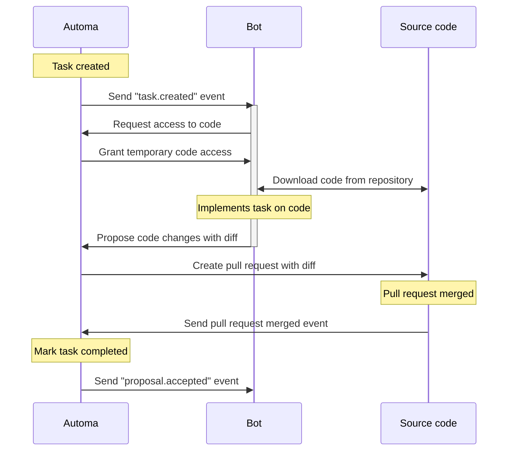

In Automa, every bot task follows a structured lifecycle, from creation to completion. Understanding these stages is key to building reliable bots that integrate smoothly with your development workflow.

 

### Task created

When a task is assigned to a bot, Automa initiates the process by sending a webhook notification.

<Steps>
  <Step title="Send task created event">
    Automa sends a [`task.created`](/webhooks/task-created) event to the bot's webhook URL.
  </Step>
  <Step title="Request access to code">
    Since the access to source code is managed by Automa, the bot must request temporary access to download and view the code necessary to implement the task.
  </Step>
  <Step title="Send code access details">
    Automa verifies the bot's authorization and provides a short-lived, permission-scoped URL. This allows the bot to securely download the code required for the task.
  </Step>
  <Step title="Download code">
    The bot uses the provided URL to download the code and prepare for implementation.

    For the above 3 steps, you can use the `code.download` method from the [Bot SDK](/sdks/bot).

  </Step>
</Steps>

### Task implemented

Once the bot has the code, it can begin its work. After completing the task, it proposes the changes back to Automa.

<Steps>
  <Step title="Propose code changes">
    The bot sends the completed work back to Automa as a **diff**, along with a title and description for the pull request.

    You can use the `code.propose` method from the [Bot SDK](/sdks/bot) for this step.

  </Step>
  <Step title="Create pull request">
    Automa creates a pull request in the source code repository, making the changes available for review.
  </Step>
</Steps>

### Pull request merged

Once the pull request is merged, the task is considered complete.

<Steps>
  <Step title="Pull request merged event">
    The source code host sends a pull request merged event to Automa.
  </Step>
  <Step title="Mark task completed">
    Automa updates the task's status to "completed" in its system.
  </Step>
  <Step title="Send proposal accepted event">
    Automa sends a [`proposal.accepted`](/webhooks/proposal-accepted) event to
    the bot's webhook URL, confirming that the proposed changes have been
    successfully merged.
  </Step>
</Steps>
